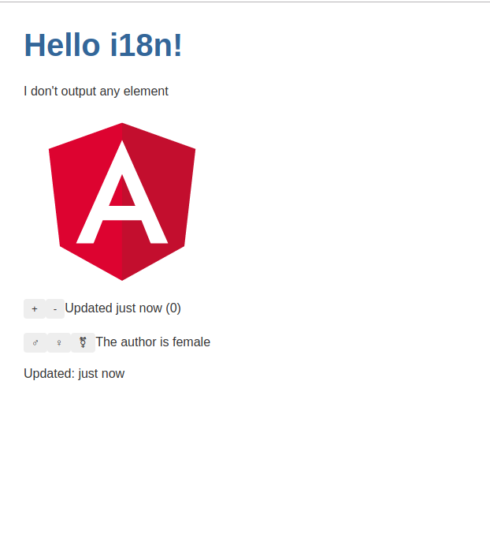
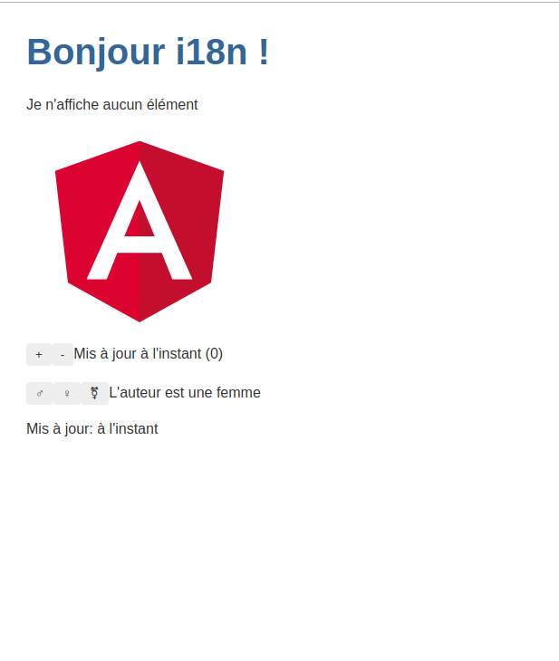

# Angular Internationalization (i18n)

The i18n Example for a simple example of an AOT-compiled app, translated into French.

## Functionality overview

Internationalization is the process of designing and preparing your app to be usable in different languages. Localization is the process of translating your internationalized app into specific languages for particular locales.

This project was generated with [Angular CLI](https://github.com/angular/angular-cli) version 8.2.2.

## Development server

Run `ng serve` for a dev server. Navigate to `http://localhost:4200/`. The app will automatically reload if you change any of the source files.

## Code scaffolding

Run `ng generate component component-name` to generate a new component. You can also use `ng generate directive|pipe|service|class|guard|interface|enum|module`.

## Build

Run `ng build` to build the project. The build artifacts will be stored in the `dist/` directory. Use the `--prod` flag for a production build.

## Running unit tests

Run `ng test` to execute the unit tests via [Karma](https://karma-runner.github.io).

## Running end-to-end tests

Run `ng e2e` to execute the end-to-end tests via [Protractor](http://www.protractortest.org/).

## Further help

To get more help on the Angular CLI use `ng help` or go check out the [Angular CLI README](https://github.com/angular/angular-cli/blob/master/README.md).

# Screenshots

